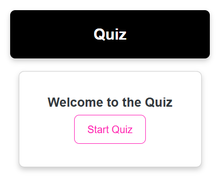

##  Proyecto Quiz Karen Salazar 💟

# Introducciòn

Este es un proyecto de una aplicación de cuestionario simple creada con HTML, CSS y JavaScript. La aplicación obtiene preguntas de trivia de la API de Open Trivia Database y se las presenta al usuario. Los usuarios pueden seleccionar respuestas y recibir comentarios sobre su desempeño, incluida una puntuación final con una representación visual de las respuestas correctas e incorrectas.

## Características

- Interfaz amigable con estilos de Bootstrap.
- Obtiene preguntas de trivia de una API.
- Muestra preguntas con respuestas de opción múltiple.
- Muestra el puntaje al final del quiz.
- Presenta un gráfico circular que visualiza el porcentaje de respuestas correctas e incorrectas.

## Pagina de Inicio del QUIZ

## Resultado del QUIZ 

## Requisitos Previos
Antes de ejecutar la aplicación, asegúrate de tener lo siguiente:

- Un navegador web moderno (por ejemplo, Chrome, Firefox)
- Conocimientos básicos de HTML, CSS y JavaScript

## Tecnologías Utilizadas

- **HTML**: Estructura básica de la aplicación.
- **CSS**: Estilos para la interfaz de usuario.
- **JavaScript**: Lógica de la aplicación y manejo de eventos.
- **Axios**: Para realizar solicitudes HTTP a la API.
- **Bootstrap**: Para estilos y diseño responsivo.

## Explicación del Código
# HTML (index.html)
El archivo HTML proporciona la estructura para la aplicación de quiz. Incluye:

· Encabezado: Muestra el título del quiz.
·Componente de Tarjeta: Contiene el botón de inicio del quiz y botones de preguntas y respuestas generados dinámicamente.
·Tarjeta de Puntaje: Muestra el puntaje final y un gráfico.
# CSS (style.css)
El archivo CSS da estilo a la aplicación, haciéndola visualmente atractiva. Estilos clave incluyen:

.hide: Una clase de utilidad para ocultar elementos.
.card: Estilos para los componentes de tarjeta.
.quiz-header: Estilos para el encabezado del quiz.
# JavaScript (main.js)
El archivo JavaScript contiene la lógica del quiz:

·Obteniendo Preguntas: La función getQuestions obtiene preguntas de trivia de la API.
·Lógica del Juego: Las funciones manejan el inicio del quiz, la presentación de preguntas, la selección de respuestas y la visualización de resultados.
·Gráficos: La función showFinalScoreChart utiliza Chart.js para visualizar el puntaje final.

## Instalaciòn
Clona el repositorio:
Git clone https://github.com/karensalazar3/ProyectoQuizKaren

## Contribuciones
¡Las contribuciones son bienvenidas! Si deseas contribuir a este proyecto, por favor, haz un fork del repositorio y envía un pull request. 👾🚀🙌

## Esctructura del Proyecto
- 🩵index.html➡️# Página principal de la aplicación.
- 💜style.css 🔜#Estilos CSS.
- 💛main.js   ➡️#Lógica de la aplicación.

## Licencia
Este proyecto está bajo la Licencia MIT. Consulta el archivo LICENSE para más detalles.
